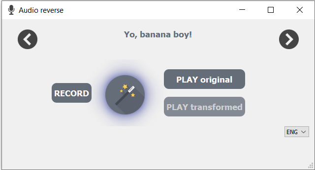

# Audio-reverse
Application to reverse audio, recorded via microphone

Easy start: Press "Record" and say something.
 You can use a tip sentence at the bottom of the application.
 It loads palindrom, which is a word, phrase, verse or sentence that reads the same forwards and backwards.

Using left and right arrows you can change tip to next of previous palindrom.
 Press "Magic wand" to let the algorithm reverse audio and enjoy with your "Abracadabra".
